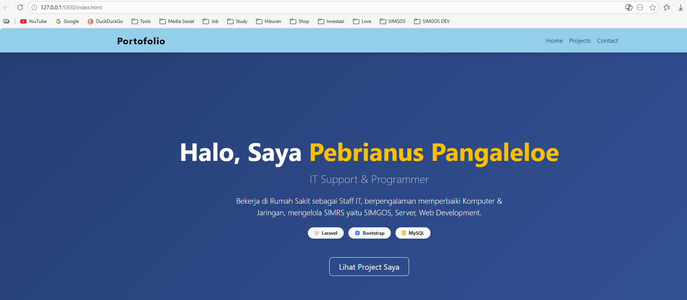
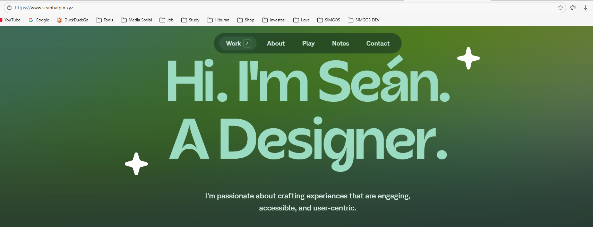
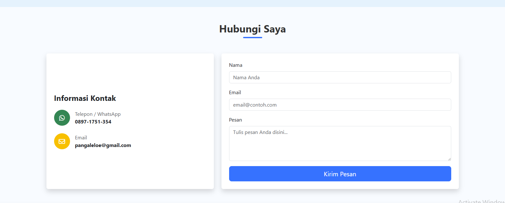
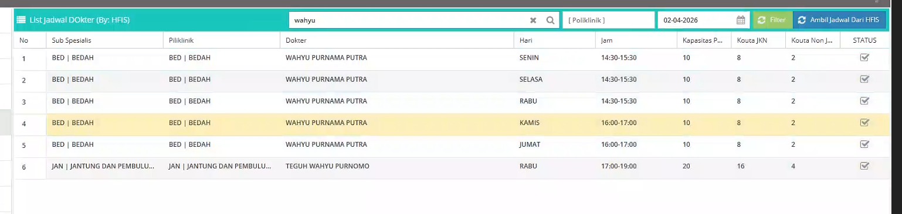

# 🏥 Hospital Custom Billing & POS System

## 📖 Latar Belakang & Masalah
Project ini dikembangkan untuk melengkapi sistem **SIMGOS** (Sistem Informasi Manajemen Rumah Sakit open-source) yang digunakan di tempat saya bekerja.

Sebagai Rumah Sakit Swasta, kami memiliki banyak pasien dengan asuransi swasta (Non-BPJS). SIMGOS memiliki keterbatasan dalam menangani skema pembayaran **Split Bill** atau *Cost Sharing*, di mana satu tagihan harus dipecah menjadi dua kuitansi berbeda (misal: 80% ditanggung asuransi, 20% *excess* dibayar pasien).

Aplikasi ini dibuat untuk menjembatani celah tersebut, memungkinkan kasir mencetak kuitansi terpisah yang valid untuk klaim asuransi sekaligus mencatat pendapatan RS secara akurat.

## 🌟 Fitur Utama

### 1. Advanced Split Billing (Multi-Payer) 💳
Fitur kunci aplikasi ini. Memungkinkan kasir untuk memecah satu tagihan pasien menjadi beberapa metode pembayaran atau penanggung jawab.
* **Skenario:** Pasien Rawat Jalan dengan total tagihan Rp 1.000.000.
* **Solusi:** Sistem dapat memproses Rp 800.000 tagihan ke Asuransi A (cetak invoice asuransi) dan Rp 200.000 tunai dari pasien (cetak kuitansi pasien) dalam satu kali transaksi.

### 2. Manajemen Shift Kasir (Shift Handover) ⏱️
Sistem *Open & Close Cashier* yang ketat untuk mendukung operasional RS 24 jam (3 Shift: Pagi, Sore, Malam).
* **Buka Kasir:** Kasir wajib input modal awal (petty cash) saat login.
* **Tutup Kasir:** Saat ganti shift, sistem otomatis merekap total penerimaan uang tunai, debit, dan kredit pada jam dinas tersebut untuk disetor ke keuangan.

### 3. Multi-Unit Point of Sales 🏥
Mendukung pemisahan loket kasir berdasarkan unit layanan untuk memudahkan pelaporan pendapatan per departemen:
* Kasir Rawat Jalan
* Kasir IGD (Instalasi Gawat Darurat)
* Kasir Penunjang Medis (Radiologi & Laboratorium)

### 4. Pelaporan Real-time
* Laporan pendapatan per shift (Handover report).
* Rekapitulasi klaim asuransi vs pendapatan tunai harian.

## 📸 Galeri Fitur

### Split Payment / Pembagian Tagihan
*Solusi untuk pasien asuransi swasta dengan excess klaim.*

### Manajemen Shift (Buka/Tutup Kasir)
*Memastikan keamanan uang kas saat pergantian jam dinas.*

### Dashboard Kasir Unit

## 🛠️ Teknologi yang Digunakan
* **Backend:** Laravel (PHP)
* **Database:** MySQL / MariaDB (Integrasi data pasien)
* **Frontend:** Bootstrap, JavaScript
* **Tools:** Thermal Printer Integration (ESC/POS)

---
*Dikembangkan oleh [Pebrianus](https://github.com/pebrianus)*